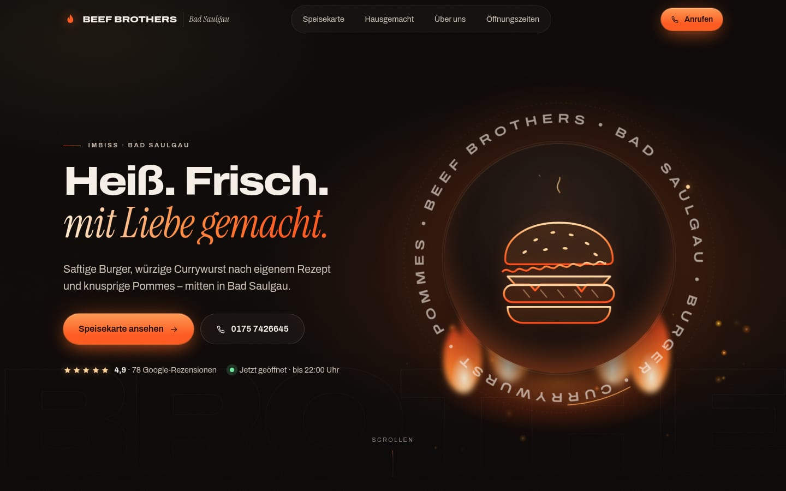

# Beef Brothers Bad Saulgau: Premium-Entwurf

Neugestaltung von [beefbrothersbadsaulgau.de](https://www.beefbrothersbadsaulgau.de/) als hochwertige One-Page-Website. Sie besteht aus reinem HTML, CSS und etwas JavaScript, ohne Framework und ohne externe Bibliotheken.

## Ansehen

- **Einzeldatei:** `standalone/beef-brothers.html` herunterladen und per Doppelklick öffnen. Schriften, CSS und JS sind eingebettet (≈ 360 KB).
- **Hosting:** Den Inhalt von `dist/beef-brothers/` (oder direkt diesen Ordner) auf beliebigen Webspace hochladen.
- **Lokal:** `index.html` in diesem Ordner im Browser öffnen.

Die Ausgaben baut `npm run build:restaurants`, und `npm run build` baut alles.

## 1. Analyse der bestehenden Website

| Frage | Befund |
| --- | --- |
| **Inhalte** | Startseite mit Begrüßungstext, Speisekarte, Kontakt, Impressum |
| **Bereiche/Funktionen** | Speisekarte mit Burgern (einzeln + Menü), Currywurst, Rindswurst, Schnitzel, Snacks, Softdrinks; Kontaktseite mit Adresse, Telefon, Öffnungszeiten |
| **Zielgruppe** | Laufkundschaft und Stammgäste in Bad Saulgau, die schnell, gut und günstig essen wollen, oft mobil unterwegs |
| **Behalten** | Alle Gerichte und Preise, die eigenen Aussagen (frische Zutaten, schnelle Zubereitung, echte Gastfreundschaft, Currywurst nach eigenem Rezept), Kontaktdaten, Öffnungszeiten, Inhaberangabe |
| **Schwächen** | Inhalte auf mehrere Unterseiten verteilt, keine klare Handlungsaufforderung (Anrufen/Route), Google-Bewertung (4,9 ★) nicht sichtbar, kein „Jetzt geöffnet“, Platzhalter statt E-Mail auf der Kontaktseite |

## 2. Neues Konzept

**Luxuriös + kraftvoll + warm.** Das Feuer ist das Markenmotiv: nicht als GIF, sondern als Licht.

- **Farben:** fast schwarzer, warmer Hintergrund (`#0a0807`), Off-White-Text, Feuer-Orange (`#ff5a1f` → `#ff8a3d`) nur gezielt eingesetzt, dazu dezentes Gold (`#e9b872`).
- **Typografie:** zwei Schriften. *Archivo* (breit, kräftig) für Headlines und Text, *Instrument Serif Italic* für die eleganten Akzentzeilen. Beide sind selbst gehostet (DSGVO).
- **Hero:** großes, zentrales SVG-Emblem. Der Schriftring dreht sich in 60 s nahtlos um die eigene Achse, ein goldener Orbit kreist schneller, eine Lichtreflexion wandert über den Ring, der Burger schwebt leicht und dampft. Dahinter lodern Flammenzungen, im ganzen Hero steigen glühende Funken (Canvas) auf.
- **Feuer:** weich maskierte Flammenformen mit Farbverlauf. Sie flackern nur über `transform`/`opacity`, ohne Blur-Filter, und tauchen dreimal auf: im Hero, bei „Hausgemacht“ und im Abschluss-CTA.
- **Struktur (One-Page):** Hero → Laufband → Was uns ausmacht → Speisekarte (Tabs) → Hausgemacht: Currywurst → Über uns + Bewertung → Öffnungszeiten & Anfahrt (Live-Status, Karte per 2-Klick) → Abschluss-CTA → Footer. Auf dem Handy gibt es zusätzlich eine Schnellleiste: Anrufen · Speisekarte · Route.

## 3. Performance & Robustheit

- Animationen laufen per CSS-Keyframes über `transform`/`opacity`. JS gibt es nur für Funken, Parallaxe, Tabs und Öffnungsstatus.
- Funken sind auf ≤ 64 Partikel (Handy: 26) und DPR ≤ 1,5 begrenzt. Sie pausieren, sobald der Hero nicht sichtbar oder der Tab im Hintergrund ist. Die Hero-Animationen pausieren dann ebenfalls.
- Schwächere Geräte (Touch, ≤ 4 Kerne, < 760 px) bekommen weniger Flammen, keine Reflexion und keinen Backdrop-Blur.
- `prefers-reduced-motion` schaltet alle Bewegungen ab.
- Ohne JavaScript ist alles sichtbar, und die Speisekarte zeigt alle Kategorien untereinander. Fällt das Skript aus, blendet ein Sicherheitsnetz nach 3 s alle Inhalte ein.
- Getestet bei 320, 390 und 1440 px Breite. Es gibt keinen horizontalen Scroll und keine Konsolenfehler.

## Quellen & offene Punkte

Alle Inhalte stammen von der bestehenden Website (über den Suchindex abgerufen, weil die Seite aus der Arbeitsumgebung nicht direkt erreichbar war) bzw. aus dem Google-Eintrag. Es wurde nichts erfunden: keine Bewertungstexte, keine Fotos, keine zusätzlichen Gerichte.

Vor der Veröffentlichung prüfen:

- [ ] **Preise** mit der aktuellen Speisekarte abgleichen (v. a. Menüpreise Chili Cheeseburger/Chicken Burger: 16,00 €).
- [ ] **Öffnungszeiten:** Die Website nennt Mo–Fr 11–22 Uhr und Sa 14–22 Uhr. Google zeigte am 1. 10. 2026 „schließt um 21:00“. Klären, welche Angabe stimmt (`HOURS` in `main.js`, Tabelle, Footer, JSON-LD).
- [ ] **Bewertung:** 4,9 ★ / 78 Rezensionen (Stand 1. 10. 2026) aktualisieren.
- [ ] Die frühere Speisekarte hatte laut Presse sechs Burger. Im Suchindex waren fünf zu finden; gegebenenfalls ergänzen.
- [ ] Echte Fotos (Burger, Currywurst, Laden) können die SVG-Illustrationen ergänzen.
- [ ] E-Mail, ggf. USt-IdNr. und eine vollständige Datenschutzerklärung ergänzen. Danach `noindex` entfernen.
